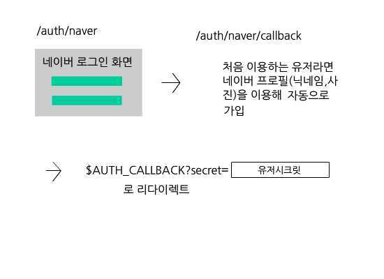
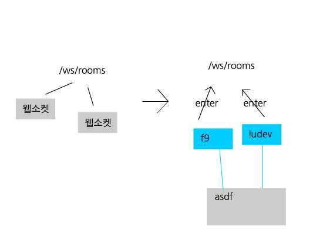
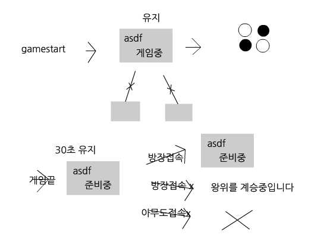
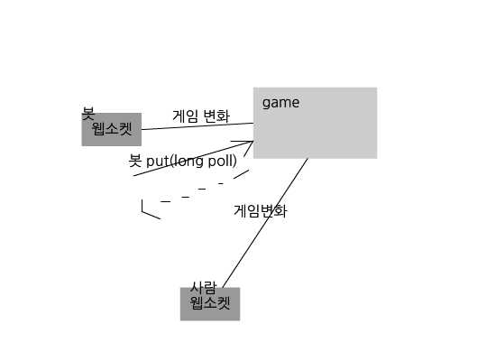

# 큰 그림

사람은 오델로 클라이언트를 이용해 방을 만들고 접속합니다. 방장이 게임시작 버튼을 누르면 그 방에 진행되는 게임을 식별하는 문자열과 게임판이 나타납니다. 사람은 이 보드판으로 관전 및 게임 플레이가 가능하고 봇은 문자열을 이용해 그 게임에 접근할 수 있습니다. 

# 로그인

대부분의 api는 유저시크릿을 요구합니다. 이 유저시크릿은 30문자의 알파벳과 숫자로 이루어진 문자열이며 고유합니다. 이 유저시크릿을 얻기 위해서는 네이버 oauth를 거쳐야 합니다. 

api 서버의 /auth/naver로 리다이렉트해주면 위와 같은 과정을 거쳐 오델로 클라이언트의 콜백 페이지로 다시 리다이렉트 해줍니다(맨 마지막 과정) 콜백 페이지는 secret쿼리를 통해 유저시크릿을 얻을 수 있습니다.

# 방

모든 방의 리스트와 특정 방의 정보(인게임여부, 유저)는 /rooms와 /rooms/{방이름}을 통해 얻을 수 있습니다. 그러나 이것외의 방에 관련된 동작(입장, 게임시작)은 웹소켓을 통해 이루어집니다. 

## 웹소켓 접속

먼저 /ws/rooms 웹소켓에 접속합니다.

## 방 입장 및 파기

방이름과 유저시크릿을 담은 enter 패킷을 보내면 특정 방에 입장할 수 있습니다. 만약 해당하는 방이 없다면 자동으로 판 뒤 입장합니다. 

만약 기존에 있던 방이라면 /rooms/{방이름}을 통해 그 방의 정보를 가져올 수 있습니다.

입장 과정을 거친 웹소켓 연결은 특정 유저의 특정 방에 대한 연결로 승급되며 오델로 클라이언트는 이 연결을 통해 방의 상태 변화를 통보받습니다. 방장의 경우 이 연결을 통해 방의 관리도 가능합니다. 

한번 승급된 웹소켓 연결은 다른 방으로 입장하는 것이 불가능합니다.(enter는 한번!) 만약 다른 방에 입장하고 싶다면 기존 연결을 끊고 새로운 연결을 만들어 다시 방 입장 절차를 거쳐야합니다. 한 유저는 오직 한 웹소켓 연결만을 가질 수 있습니다. 만약 다른 웹소켓 연결이 만들어진다면 기존 연결은 자동으로 끊어집니다.

방장의 접속이 끊어진다면 무작위 유저 한명을 방장으로 바꾸는 action 패킷이 브로드캐스트됩니다.

## 방 관리하기

방의 관리를 하기 위해서는 action 패킷을 보내야 합니다. action패킷을 통해 흑, 백 지정 / 방장 변경 / 강퇴 / 게임시작이 가능하며 이는 모두 같은 방의 자신을 포함한 모든 유저들에게 브로트캐스트됩니다. 

## 게임 시작 ~ 게임 종료

방장이 action 패킷을 통해 게임을 시작했을 경우 게임아이디(전술한 특정 게임을 식별하는 문자열)이 포함된 gamestart패킷이 브로드캐스트되며 그 방은 게임중 상태로 돌입합니다.

준비중 상태의 방은 모든 유저가 나갈 경우 사라지게 됩니다. 그러나 게임중 상태로 돌입된 방은 모든 유저가 나가더라도 유지되며 방에 없던 유저들도 /rooms/{방이름}을 통해 이 방에서 진행되는 게임의 게임아이디를 얻을 수 있습니다. 그러므로 오델로 클라이언트는 방이름만 기억하고 있다면 게임화면과 방화면을 완전히 분리할 수 있습니다. 

게임이 끝난 후에도 방은 30초동안 유지되며 방장이 재접속을 했을 경우 원상복귀하며 방장이 재접속하지 않았을 경우는 무작위 유저가 방장이 되며 아무도 접속하지 않았을 경우 방은 사라집니다.

# 게임플레이 및 관전

## 큰그림

기본적으로 웹소켓으로 게임에 일어난 모든 변화를 통보받고 /games/{게임아이디}/actions 로 게임에 변화를 줍니다. 또한 /games/{게임아이디} 를 통해 게임에 대한 정보(보드판, 남은 시간)를 얻을 수 있습니다.

## 웹소켓 접속

먼저 /ws/games로 접속합니다

## enter

게임아이디와 담은 enter 패킷을 보내면 방의 경우와 비슷하게 연결이 승급됩니다. 다른점은 유저시크릿을 안 받는다는 것입니다. 그렇기에 봇과 오델로 클라이언트가 동시에 한 계정으로 게임 관전이 가능합니다. 

## 수놓기

수놓기는 /games/{게임아이디}/actions 에 헤더에 유저시크릿이 담긴 post요청을 보내면 됩니다. long_poll을 true로 해놨을 경우 api서버가 상대가 수를 놓을 때까지 응답을 연기합니다. 그래서 이론상 오직 http요청만으로 봇을 구현하는 것이 가능합니다. (수놓기 -> 응답 받으면 보드판 다시 가져오기)

수를 놓게되면 게임 웹소켓에서 put 패킷이 브로드캐스트됩니다. 가끔 한 플레이어가 어떤 수도 둘 수 없는 경우가 있는데 이 경우 그 플레이어의 턴은 스킵되며 웹소켓에서 none수가 담긴 put 패킷이 브로드캐스트됩니다. 

## 수무르기

수무르기 또한 /games/{게임아이디}/actions 를 통해 가능합니다. undo를 통해 수무르기 신청을 하고 이 신청했을 당시의 상대 유저 전 턴 인덱스를 서버가 기억해둡니다. 그리고 게임 웹소켓에 브로드캐스트됩니다.

undo_answer을 통해 이 수무르기를 응할지 말지 결정하는 것이 가능합니다. 이 또한 웹소켓에 브로드캐스트됩니다. 수무르기가 받아들여 지지도 거절되지도 않은 상태에서는 두 플레이어 모두 수무르기 신청을 다시 하는 것이 불가능합니다. 

## 게임 종료

두 플레이어 모두 어떤 수도 둘 수 없거나 한 플레이어가 모든 시간을 소모했을 때 end 패킷이 브로드캐스트되며 게임은 사라지게 됩니다. 

